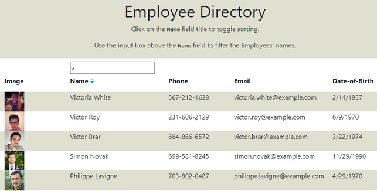
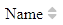
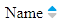
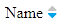

# Employee Directory with React
This repo features an employee directory built using React.

## Usage
On load, data for 50 people is fetched from the `randomuser.me` [API](https://randomuser.me). An image, name, phone number, email, and date-of-birth is displayed for each employee. (On small screens only the image and name fields are displayed.)

The list of employees is initially unsorted. Click on the `Name` field heading to cycle through the sort options:
* None: 
* Ascending: 
* Descending: 

Employee names can be filtered to match text entered into the input box above the name field. The filter is case-insensitive. 

The filter and sort options can be applied simultaneously.

## Try It
You can view the deployed site [here](https://cek333.github.io/Employee_Directory_with_React).